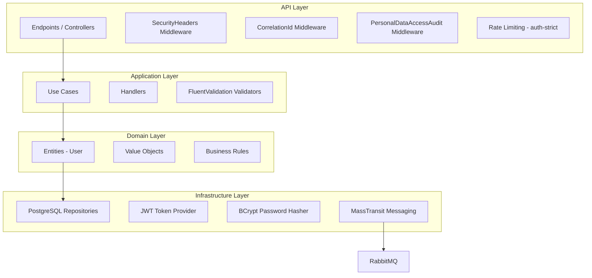
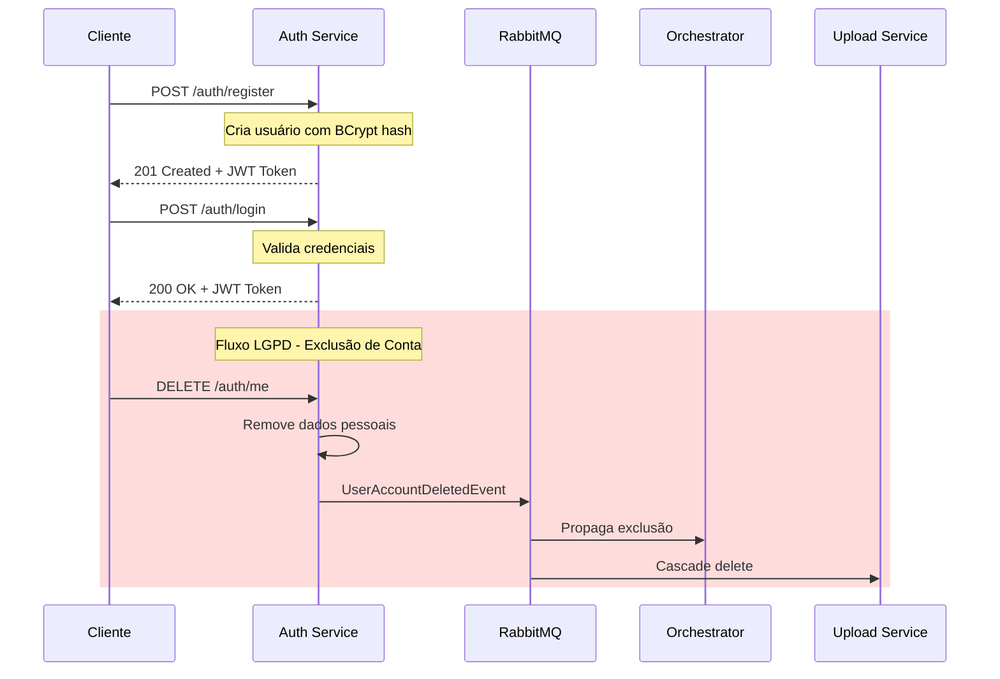
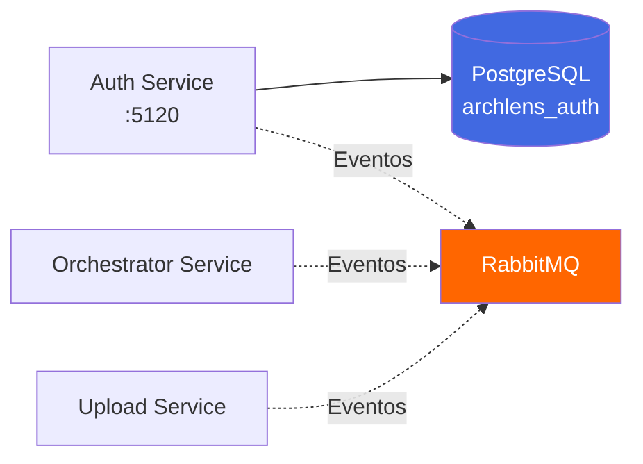
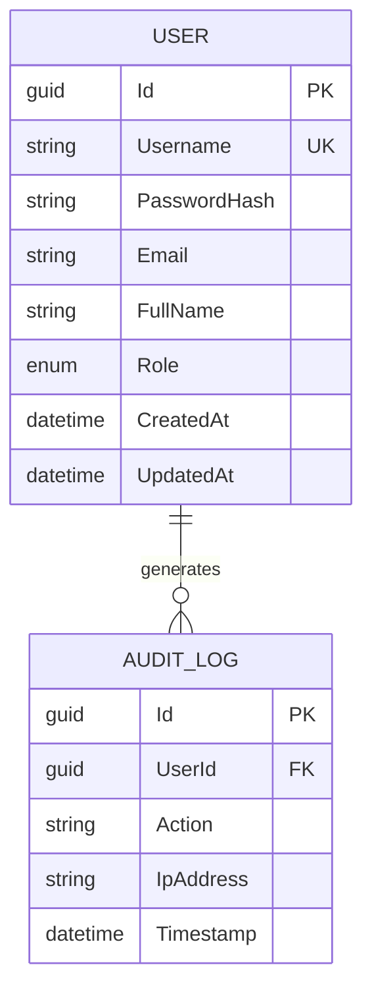
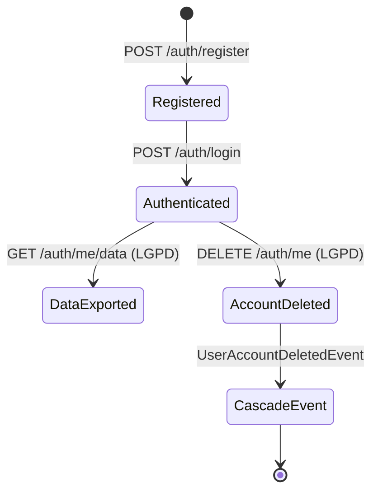
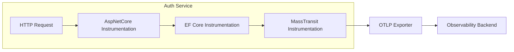

# ArchLens - Auth Service

[](https://github.com/archlens-platform/archlens-auth-service/actions/workflows/ci.yml)
[](https://sonarcloud.io/summary/new_code?id=archlens-platform_archlens-auth-service)
[](https://sonarcloud.io/summary/new_code?id=archlens-platform_archlens-auth-service)
[](https://sonarcloud.io/summary/new_code?id=archlens-platform_archlens-auth-service)
[](https://sonarcloud.io/summary/new_code?id=archlens-platform_archlens-auth-service)
[](https://sonarcloud.io/summary/new_code?id=archlens-platform_archlens-auth-service)
[](https://sonarcloud.io/summary/new_code?id=archlens-platform_archlens-auth-service)
[](https://sonarcloud.io/summary/new_code?id=archlens-platform_archlens-auth-service)

> **Microsserviço de Autenticação, Autorização e Conformidade LGPD**
> Hackathon FIAP - Fase 5 | Pós-Tech Software Architecture + IA para Devs
>
> **Autor:** Rafael Henrique Barbosa Pereira (RM366243)

[](https://dotnet.microsoft.com/)
[](https://www.docker.com/)
[](https://blog.cleancoder.com/uncle-bob/2012/08/13/the-clean-architecture.html)
[](https://www.postgresql.org/)
[](https://www.rabbitmq.com/)
[](https://jwt.io/)

## 📋 Descrição

O **Auth Service** é o microsserviço responsável pela autenticação e autorização do ecossistema ArchLens. Gerencia o cadastro de usuários, login via JWT (HMAC-SHA256), controle de roles (User/Admin), e conformidade com a **LGPD** — permitindo exportação e exclusão de dados pessoais com cascata de eventos. Implementa **Rate Limiting** rigoroso para proteção contra ataques de força bruta, além de middlewares de segurança (SecurityHeaders, CorrelationId, PersonalDataAccessAuditMiddleware).

## 🏗️ Arquitetura

O projeto segue os princípios de **Clean Architecture**:



## 🔄 Saga Pattern - Fluxo de Eventos

Este serviço participa da **Saga Orquestrada** como responsável pela autenticação e conformidade LGPD:



## 🛠️ Tecnologias

| Tecnologia | Versão | Descrição |
|------------|--------|-----------|
| .NET | 9.0 | Framework principal |
| PostgreSQL | 17 | Banco de dados relacional |
| Entity Framework Core | 9.x | ORM para PostgreSQL |
| FluentValidation | 11.x | Validação de DTOs |
| MassTransit | 8.x | Message Broker abstraction |
| RabbitMQ | 3.x | Message Broker |
| BCrypt.Net | 4.x | Hashing de senhas |
| JWT Bearer | - | Autenticação HMAC-SHA256 |
| OpenTelemetry | 1.x | Traces e Métricas |
| Serilog | 4.x | Logs Estruturados |
| Swagger/OpenAPI | 6.x | Documentação da API com JWT Bearer |

## 🔒 Isolamento de Banco de Dados

> ⚠️ **Requisito:** "Nenhum serviço pode acessar diretamente o banco de outro serviço."

Este serviço acessa **exclusivamente** seu próprio banco PostgreSQL (`archlens_auth`). A comunicação com outros serviços é feita **apenas via RabbitMQ (eventos)**:



**Eventos publicados:** `UserAccountDeletedEvent`
**Eventos consumidos:** Nenhum (serviço produtor)

## 📁 Estrutura do Projeto

```
archlens-auth-service/
├── src/
│   ├── ArchLens.Auth.Api/                # API Layer
│   │   ├── Endpoints/                    # Minimal APIs
│   │   │   ├── AuthEndpoints.cs          # Login, Register, LGPD
│   │   │   └── SeedEndpoints.cs          # Seed Admin
│   │   ├── Middlewares/                   # Security, Correlation, Audit
│   │   └── Program.cs                    # Entry point (:5120)
│   │
│   ├── ArchLens.Auth.Application/        # Application Layer
│   │   ├── UseCases/                     # Commands/Queries
│   │   └── Validators/                   # FluentValidation
│   │
│   ├── ArchLens.Auth.Domain/             # Domain Layer
│   │   ├── Entities/                     # User
│   │   └── Interfaces/                   # Contratos
│   │
│   └── ArchLens.Auth.Infrastructure/     # Infrastructure Layer
│       ├── Persistence/                  # EF Core + PostgreSQL
│       ├── Security/                     # JWT, BCrypt
│       └── Messaging/                    # MassTransit Publishers
│
└── tests/
    └── ArchLens.Auth.Tests/              # Testes unitários e integração
```

## 🚀 Como Executar

### Pré-requisitos
- .NET 9.0 SDK
- Docker (para PostgreSQL e RabbitMQ)

### Passos

```bash
# 1. Subir infraestrutura
docker-compose up -d postgres rabbitmq

# 2. Executar a API
dotnet run --project src/ArchLens.Auth.Api
```

A API estará disponível em: `http://localhost:5120`

### Seeds (Usuários Padrão)

| Usuário | Senha | Role |
|---------|-------|------|
| `user` | `User@123` | User |
| `admin` | `Admin@123` | Admin |

```bash
# Criar admin via endpoint de seed
POST http://localhost:5120/auth/seed-admin
```

## 📡 Endpoints

### Autenticação (`/auth`)

| Método | Endpoint | Auth | Descrição |
|--------|----------|------|-----------|
| POST | `/auth/login` | ❌ | Autenticação e geração de JWT |
| POST | `/auth/register` | ❌ | Registro de novo usuário |
| GET | `/auth/me/data` | 🔐 JWT | Exportação de dados pessoais (LGPD) |
| DELETE | `/auth/me` | 🔐 JWT | Exclusão de conta com cascade (LGPD) |
| POST | `/auth/seed-admin` | ❌ | Seed do usuário admin |

### Rate Limiting

| Policy | Limite | Janela | Endpoints |
|--------|--------|--------|-----------|
| `auth-strict` | 5 requisições | 15 segundos | `/auth/login`, `/auth/register` |

## 📊 Diagrama de Entidades



## 📈 Fluxo de Negócio



## 📨 Eventos do Saga

### Eventos Publicados

| Evento | Quando |
|--------|--------|
| `UserAccountDeletedEvent` | Usuário exclui sua conta (LGPD) |

### Conformidade LGPD

| Endpoint | Direito LGPD | Descrição |
|----------|-------------|-----------|
| `GET /auth/me/data` | Portabilidade (Art. 18, V) | Exporta todos os dados pessoais em JSON |
| `DELETE /auth/me` | Eliminação (Art. 18, VI) | Remove conta e publica evento de cascade |

## 🧪 Testes

```bash
# Rodar todos os testes
dotnet test

# Rodar com cobertura
dotnet test --collect:"XPlat Code Coverage" --settings coverlet.runsettings

# Testes de integração (requer Docker)
dotnet test --filter "Category=Integration"
```

## 🔧 Configuração

### Variáveis de Ambiente

| Variável | Descrição |
|----------|-----------|
| `ConnectionStrings__DefaultConnection` | String de conexão PostgreSQL |
| `Jwt__Key` | Chave HMAC-SHA256 para assinatura JWT |
| `Jwt__Issuer` | Issuer do token JWT |
| `Jwt__Audience` | Audience do token JWT |
| `Jwt__ExpirationMinutes` | Tempo de expiração do token |
| `RabbitMQ__Host` | Host do RabbitMQ |
| `RabbitMQ__Username` | Usuário do RabbitMQ |
| `RabbitMQ__Password` | Senha do RabbitMQ |
| `OpenTelemetry__Endpoint` | Endpoint do OTLP Exporter |

## 🐳 Docker

```bash
docker build -t archlens-auth-service .
docker run -p 5120:8080 archlens-auth-service
```

## 📈 Observabilidade

O serviço possui integração completa com **OpenTelemetry** e **Serilog** para observabilidade:



**Instrumentações:**
- `AspNetCore` - Traces de requisições HTTP
- `EntityFrameworkCore` - Traces de operações PostgreSQL
- `MassTransit` - Traces de mensageria RabbitMQ

**Middlewares de Segurança:**
- `SecurityHeaders` - Headers de segurança (X-Content-Type-Options, X-Frame-Options, etc.)
- `CorrelationId` - Propagação de correlation ID entre serviços
- `PersonalDataAccessAuditMiddleware` - Auditoria de acesso a dados pessoais (LGPD)

### Serilog (Logs Estruturados)

```json
{
  "Timestamp": "2026-03-15T00:00:00Z",
  "Level": "Information",
  "MessageTemplate": "User {Username} authenticated successfully",
  "Properties": {
    "Username": "admin",
    "Role": "Admin",
    "CorrelationId": "abc-123",
    "ServiceName": "archlens-auth-service"
  }
}
```

---

FIAP - Pós-Tech Software Architecture + IA para Devs | Fase 5 - Hackathon (12SOAT + 6IADT)
